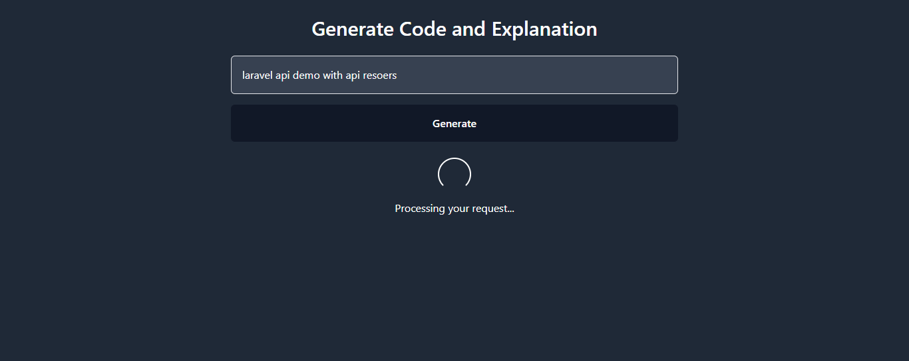

# React + Vite

This template provides a minimal setup to get React working in Vite with HMR and some ESLint rules.

[link - https://www.web-beast.com]

👉 [https://www.web-beast.com](https://www.web-beast.com/2025/01/getting-started-with-google-gemini-free.html)

**#Laravel #MachineLearning #PHPDevelopment #AI #WebBeast**

[Post - https://web-beast.com](https://www.web-beast.com/2025/01/getting-started-with-google-gemini-free.html)

Currently, two official plugins are available:

- [@vitejs/plugin-react](https://github.com/vitejs/vite-plugin-react/blob/main/packages/plugin-react/README.md) uses [Babel](https://babeljs.io/) for Fast Refresh
- [@vitejs/plugin-react-swc](https://github.com/vitejs/vite-plugin-react-swc) uses [SWC](https://swc.rs/) for Fast Refresh

# Getting Started with Google Gemini Free AI API Using React.js (Vite)

This repository contains the source code and implementation guide for integrating the **Google Gemini Free AI API** into a **React.js** project using **Vite**. The project demonstrates how to set up the environment, make API calls, and render AI-generated results in a user-friendly interface.

## Project Overview

### Features
- Easy integration with the **Google Gemini Free API**.
- Modern development setup using **React.js** and **Vite**.
- Efficient handling of API requests with Axios.
- Beginner-friendly structure for quick learning.

### Key Technologies
- **React.js**: For building the user interface.
- **Vite**: A fast and lightweight development tool.
- **Axios**: To handle HTTP requests.
- **Google Gemini API**: For AI-driven content generation.

---

## Installation Guide

### Prerequisites
- Node.js installed on your system.
- An API key for the Google Gemini API. [Get your API key here](https://aistudio.google.com/apikey).

### Steps to Run the Project

1. Clone the repository:
   ```bash
   git clone https://github.com/brijmansuriya/google-gemini-react-JS.git
   cd google-gemini-react

src/
├── ApiComponent.jsx  # Main component for input and response display
├── index.css            # Styling for the app
├── main.jsx             # Entry point for the React app
└── App.jsx              # Placeholder for additional components


### Steps to Make It Work:
1. **Place Images**:
   - Ensure `screen1.png` and `screen2.png` are located inside the `src/public/` folder in your project.
2. **Check Paths**:
   - Verify the relative paths `src/public/screen1.png` and `src/public/screen2.png` match your project structure.

Let me know if you need additional updates!


